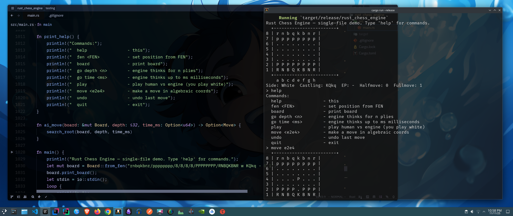
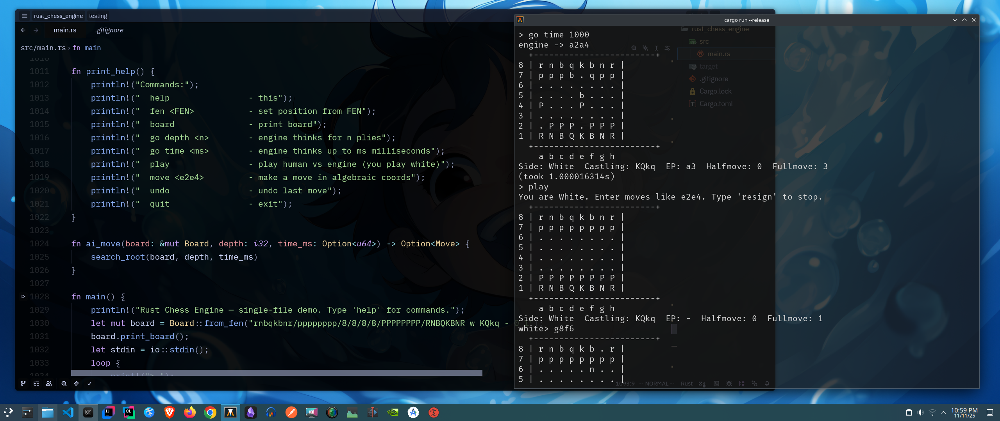

Note: Readme is also not updated yet, it will be updated soon.
---

### ⚠️ Default Branch: `main`

The `main` branch is currently **under active development**.
You may encounter **bugs, incomplete features, and frequent changes**.

This project is evolving rapidly==> issues will be fixed and improvements will be added **gradually**.

If you're exploring the codebase, expect things to break. Contributions, suggestions, and bug reports are welcome.

---

# Rust Chess Engine ==> Project Overview

| Feature                                        | Present in project | Explanation                                                                                                                                                                                                     |
| ---------------------------------------------- | --------------------- | --------------------------------------------------------------------------------------------------------------------------------------------------------------------------------------------------------------- |
| **0x88 board representation**               | Yes                 | use `pub type Sq = usize;` and `on_board(s) => (s & 0x88) == 0`. That’s the 0x88 layout.                                                                                                                    |
| **Legal move generation**                   | Yes                 | `gen_moves()` + per-piece functions generate all normal moves (pawns, knights, bishops, rooks, queens, kings, promotions, en passant, castling). Then filters out illegal moves via `is_king_attacked()` check. |
| **Alpha-Beta Search (Negamax)**             | Yes                 | Implemented as `negamax()` with `alpha`/`beta` pruning and `quiescence()` at leaf.                                                                                                                              |
| **Quiescence Search**                       | Yes                 | Defined as `fn quiescence(...)` - it extends search only on captures.                                                                                                                                           |
| **Evaluation Function**                     | Yes                 | The `eval()` gives material balance (with side to move adjustment).                                                                                                                                             |
| **Undo Stack**                              | Yes                 | `struct Undo` + `history: Vec<Undo>` store full reversible move history.                                                                                                                                        |
| **FEN Parser**                              | Yes                 | `Board::from_fen()` parses full FEN (piece placement, side, castling, en-passant, clocks).                                                                                                                      |
| **Make / Undo Move**                        | Yes                 | `make_move()` + `undo_move()` correctly handle captures, promotions, EP, and castling.                                                                                                                          |
| **Terminal UI**                             | Yes                 | Main loop with text commands (`help`, `move e2e4`, `go`, `play`, `undo`, `quit`). Prints board as ASCII.                                                                                                        |
| **Pure std, No crates**                     | Yes                 | Only uses `std::{cmp, io, time, fmt}` - no external crates.                                                                                                                                                     |
| **Runs via `cargo run --release`**           | Yes                 | It’s a self-contained binary executable.                                                                                                           |
| **Fully playable in terminal**              | Yes                 | `play` command lets you play human vs engine.                                                                                                                                                                   |
| **Castling, promotion, en passant support** | Yes                 | All explicitly implemented.                                                                                                                                                                                     |
| **Iterative deepening (limited)**           | Partial            | `search_root()` iterates over depths but without transposition tables. Still true to “depth search.”                                                                                                            |
| **No unsafe, no macros**                    | Yes                 | Pure safe Rust, no macros or `unsafe` blocks.                                                                                                                                                                   |
---

### **Run Instructions**

```bash
# 1️⃣ Clone the repo
git clone https://github.com/Abhisheklearn12/chess_in_rust.git
cd rust_chess_engine

# 2️⃣ Build in release mode
cargo build --release

# 3️⃣ Run the engine
cargo run --release
```
---
### **Usage (Inside the Engine CLI)**

Once running, you’ll see the board and a prompt like:

```
Rust Chess Engine -- single-file demo. Type 'help' for commands.
```

Type any of the following:

| Command       | Description                        |
| ------------- | ---------------------------------- |
| `help`        | Show all commands                  |
| `board`       | Print current board                |
| `move e2e4`   | Make a move                        |
| `undo`        | Undo last move                     |
| `go depth 4`  | Engine thinks N plies deep         |
| `go time 500` | Engine thinks for N milliseconds   |
| `fen <FEN>`   | Load position from FEN             |
| `play`        | Play against engine (you’re White) |
| `resign`      | Stop the game                      |
| `quit`        | Exit the program                   |

---

### Example

```bash
> move e2e4
> go depth 4
> undo
> play
```

---

### Here's the Output:
 

 
### **Notes / Future Work**

1. **Proof-of-Concept (PoC)** ==>
   This is still an early, educational version of the engine.
   It’s designed to be simple, readable, and technically correct, not yet optimized for strength or modularity.

2. **Maintainability & Modularity** ==>
   The current implementation is monolithic (~1K LOC, single file) by design for clarity.
   Future iterations will gradually move toward a cleaner module-based structure (`board.rs`, `search.rs`, `eval.rs`, etc.) for maintainability and extensibility.

3. **Feature Expansion** ==>
   Planned additions include:

   * Transposition tables (Zobrist hashing)
   * Move ordering heuristics (MVV-LVA, killer moves)
   * Improved evaluation (piece-square tables, mobility, king safety)
   * Time management and iterative deepening
   * Basic UCI protocol support for GUI integration

4. **Performance Tuning** ==>
   Although fully functional, this version prioritizes correctness and simplicity over raw speed.
   Future updates will include optimizations, profiling, and search pruning techniques.

5. **Educational Focus** ==>
   The goal of this project is to deeply understand how chess engines and search algorithms work under the hood, using Rust as a systems-level learning ground.
---

> This engine isn’t meant to beat Stockfish, it’s meant to help *understand* why Stockfish works.
---
##### Note: Gradually will add some more features, as I learn chess gradually, need to learn this sport in my own wayy.
